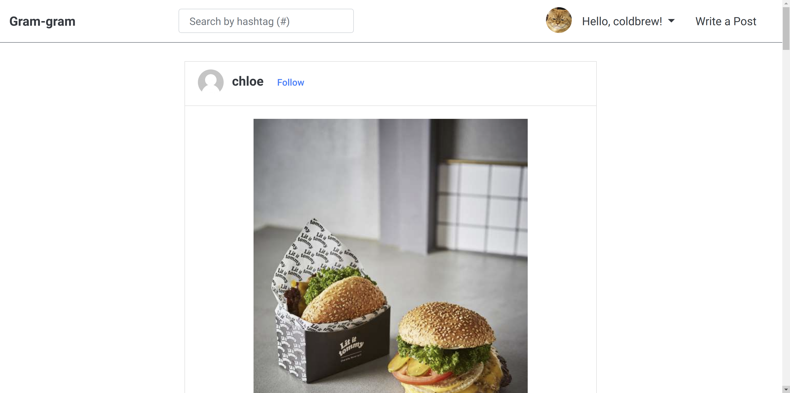
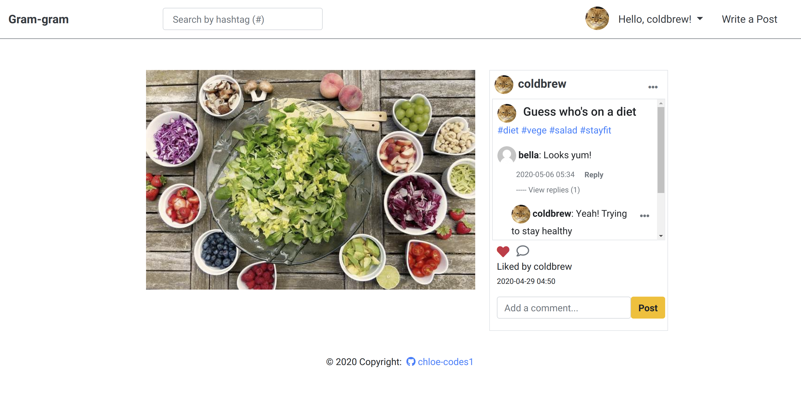
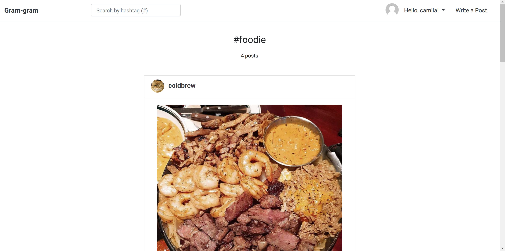

# Gram-gram

> Instagram clone with Django

 

 

## Features

- Post CRUD
- Comment 
- Reply on comment
- Follow
- Post likes
- Authentication
- Hash tags
- Search by hash tag

 

 

## Overview

 

> Index page -1

 

> Index page -2

 

> Profile page

 

> Detail page

 

> Search by hash tag

 

 