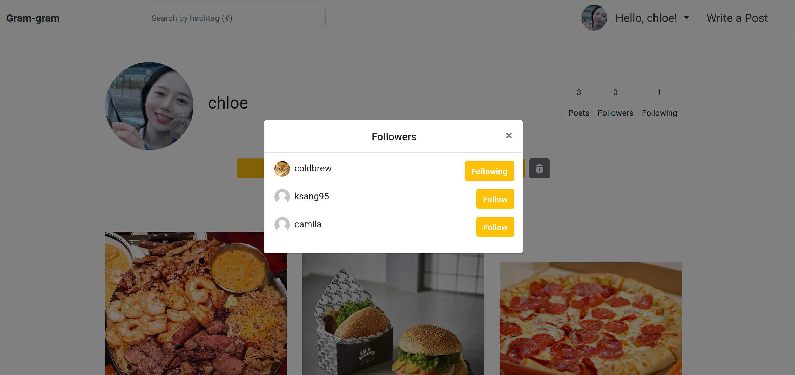

# Gram-gram

> Instagram clone with Django

 

 

## Features

 

- #### Post CRUD
  
  - Image upload
  
- #### Comment 
  
  - Reply on comment
  
- #### Follow
  
  - Follower/Following List
  
- #### Post likes

- #### Authentication

  - `Google Login API`
  - `Github Login API`

- #### Hash tags
  
  - Sort posts by hash tag
  - Search by hash tag
  
- #### Profile
  
  - Profile photo by using [gravatar](https://en.gravatar.com/)

 

 

## Overview

 

> Index -1

 

> Index -2

 

> Profile

 

> Followers

 

> Following

 

> Post detail - comments & replies

 

> Search by hash tag

 

 